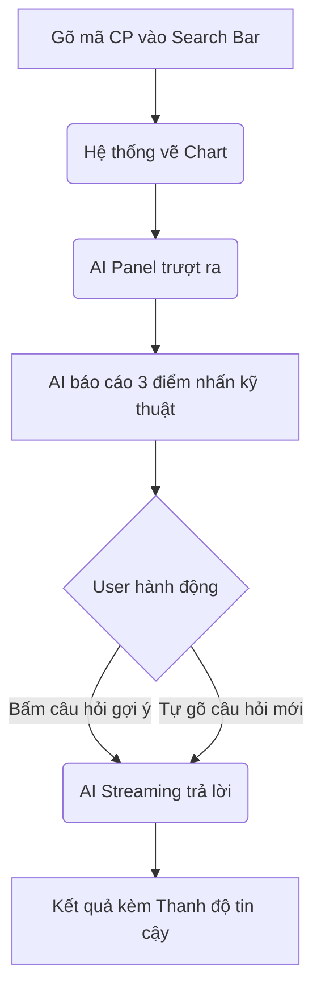
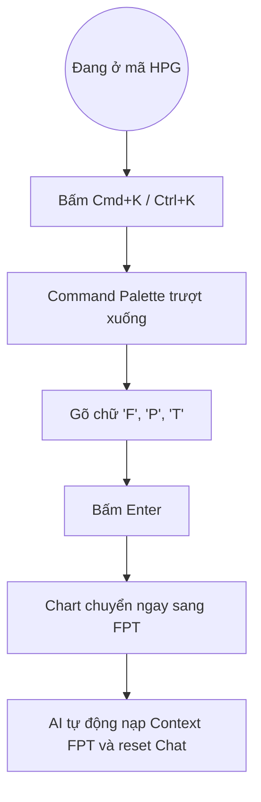

# Specification Thiết kế Trải nghiệm Người dùng - Chat-bot-stock (StockAI Predictor)

**Tác giả:** QUI  
**Ngày:** 2026-03-25

---

## 1. Tổng quan Dự án

### 1.1 Mô tả Dự án
**StockAI Predictor** là một nền tảng hỗ trợ dự đoán và phân tích thị trường chứng khoán sử dụng trí tuệ nhân tạo (AI). Dự án kết hợp **Backend (FastAPI)** và **Frontend (Next.js)** để cung cấp trải nghiệm người dùng hiện đại, trực quan và thông minh.

### 1.2 Mục tiêu Chính
- Phân tích thị trường chứng khoán theo thời gian thực
- Dự đoán xu hướng giá cổ phiếu bằng AI/Machine Learning
- Cung cấp trợ lý AI để giải đáp thắc mắc về tài chính và chứng khoán
- Hiển thị dữ liệu thị trường dưới dạng biểu đồ trực quan

### 1.3 Đối tượng Người dùng
- Nhà đầu tư cá nhân
- Người quan tâm đến thị trường chứng khoán Việt Nam
- Người dùng có kiến thức cơ bản về tài chính

---

## 2. Phân tích Hiện trạng

### 2.1 Các thành phần giao diện hiện tại

#### ChatInterface (Trợ lý AI)
- **Chức năng**: Chatbot tương tác để trả lời câu hỏi về chứng khoán
- **Thiết kế**: Dark theme với gradient emerald-cyan cho avatar AI
- **Tính năng**:
  - Hiển thị lịch sử hội thoại
  - Hiển thị trạng thái "đang trả lời" (loading animation)
  - Auto-focus ô input sau khi AI trả lời
  - Nút làm mới cuộc trò chuyện

#### InteractiveChart (Biểu đồ Giá)
- **Chức năng**: Hiển thị biểu đồ giá cổ phiếu theo thời gian
- **Thiết kế**: Dark theme với gradient background cho area chart
- **Tính năng**:
  - Biểu đồ area sử dụng Recharts
  - Hiển thị giá đóng cửa, biến động giá (%)
  - Tooltip hiển thị thông tin chi tiết khi hover
  - Loading state khi đang tải dữ liệu

#### PredictionWidget (Dự đoán AI)
- **Chức năng**: Hiển thị dự đoán xu hướng giá cổ phiếu trong 24h tới
- **Thiết kế**: Dark theme với gradient overlay
- **Tính năng**:
  - Dự đoán tăng/giảm giá
  - Mục tiêu giá dự kiến
  - Thanh progress hiển thị độ tin cậy
  - Visual indicators cho hướng tăng/giảm

### 2.2 Cấu trúc Trang Dashboard

```
┌─────────────────────────────────────────────────────┐
│                    Header (Navigation)              │
│  StockAI Predictor | Bảng điều khiển | Thị trường │
├─────────────────────────────────────────────────────┤
│  Tổng quan thị trường | Filter (1 Ngày/1 Tuần...) │
├──────────────────┬──────────────────────────────────┤
│                  │                                  │
│  Interactive     │    ChatInterface                 │
│  Chart (FPT)     │    (AI Trading Assistant)        │
│  - Biểu đồ giá   │    - Trợ lý AI                    │
│                  │    - Hỏi đáp                      │
├──────────────────┼──────────────────────────────────┤
│  Sentiment Widget│    PredictionWidget              │
│  - Phân tích cảm │    - Dự đoán 24h                   │
│    xúc           │    - Độ tin cậy                  │
└──────────────────┴──────────────────────────────────┘
```

### 2.3 Theme hiện tại
- **Background chính**: `bg-slate-950` (dark slate)
- **Background secondary**: `bg-slate-800/40` đến `bg-slate-800/90`
- **Primary accent**: `emerald-500` (màu xanh lá)
- **Secondary accent**: `cyan-500` (màu xanh nước biển)
- **Negative**: `rose-500` (màu đỏ)
- **Text**: `slate-50` đến `slate-300`

---

## 3. Khuyến nghị Thiết kế UX

### 3.1 Nguyên tắc Thiết kế

#### 3.1.1 Trải nghiệm Người dùng
1. **Trực quan và dễ hiểu**: Người dùng có thể dễ dàng hiểu được thông tin thị trường
2. **Phản hồi nhanh**: Hiển thị loading states rõ ràng và feedback tức thì
3. **Tập trung vào dữ liệu**: UI tối giản để không làm lu mờ dữ liệu quan trọng
4. **Tính nhất quán**: Thiết kế đồng bộ qua tất cả các thành phần

#### 3.1.2 Quy tắc Thiết kế
1. **Dark theme nhất quán**: Toàn bộ ứng dụng sử dụng dark theme
2. **Color psychology**: 
   - Xanh lá (emerald) cho tăng giá, thành công
   - Đỏ (rose) cho giảm giá, cảnh báo
   - Xanh nước biển (cyan) cho thông tin, hỗ trợ
3. **Typography**: Sử dụng Inter font với Vietnamese support
4. **Spacing**: Consistent spacing scale (4px, 8px, 16px, 24px, 32px)

### 3.2 Cải tiến Đề xuất

#### 3.2.1 Giai đoạn 1 - Cải tiến Ngay lập tức

##### A. Trang tổng quan (Dashboard)
1. **Thêm thanh tìm kiếm mã cổ phiếu**: Người dùng có thể nhanh chóng chuyển đổi giữa các mã cổ phiếu khác nhau
2. **Nút chọn mã cổ phiếu**: Danh sách mã phổ biến (FPT, VNM, MSN, VPB,...)
3. **Thay đổi biểu tượng avatar**: Avatar "VA" (User) nên là hình ảnh người thật hoặc icon người dùng

##### B. Trợ lý AI (ChatInterface)
1. **Cải thiện prompt gốc**: Prompt "Xin chào!" nên mở rộng để giới thiệu rõ hơn khả năng của AI
2. **Hiển thị loại tin nhắn**: Có thể thêm icon hoặc badge cho biết tin nhắn từ AI
3. **Menu nhanh**: Nút menu để xem lại lịch sử hoặc reset session

##### C. Biểu đồ (InteractiveChart)
1. **Chỉ mục biểu đồ**: Thêm các chỉ số như MA (Moving Average), RSI khi hover
2. **Lưới dữ liệu**: Thêm đường lưới ngang để dễ so sánh giá
3. **Nút download biểu đồ**: Cho phép người dùng lưu biểu đồ

##### D. Dự đoán (PredictionWidget)
1. **Thời gian dự đoán**: Hiển thị rõ thời gian dự đoán (24h tới)
2. **Lý do dự đoán**: Giải thích ngắn gọn lý do cho dự đoán tăng/giảm
3. **So sánh quá khứ**: Hiển thị độ chính xác của mô hình trong quá khứ

#### 3.2.2 Giai đoạn 2 - Tính năng Mới

##### A. Trang "Thị trường"
- Danh sách toàn bộ mã cổ phiếu
- Filter theo ngành, капит hóa
- So sánh nhiều mã cổ phiếu cùng lúc

##### B. Trang "Theo dõi"
- Danh sách mã cổ phiếu người dùng quan tâm
- Cảnh báo giá
- Lịch sử theo dõi

##### C. Trang "Bảng điều khiển"
- Tổng quan tài khoản
- Lịch sử giao dịch
- Báo cáo hiệu suất

##### D. Tính năng mới
1. **Tùy chọn theme**: Cho phép chuyển đổi giữa dark/light theme
2. **Cài đặt cảnh báo**: Cảnh báo khi giá đạt ngưỡng cụ thể
3. **Báo cáo AI**: Báo cáo phân tích chi tiết hàng ngày/tuần
4. **Chế độ demo**: Chế độ simulation để người dùng thử nghiệm

---

## 4. Sơ đồ Luồng Người dùng

### 4.1 Luồng Chính - Truy cập Dashboard

```
Người dùng truy cập trang chủ
        │
        ▼
Hiển thị Header với Navigation
        │
        ▼
Hiển thị Dashboard với:
  - InteractiveChart (mã FPT mặc định)
  - Sentiment Widget
  - PredictionWidget
  - ChatInterface
        │
        ▼
Người dùng tương tác với:
  - ChatInterface (hỏi đáp)
  - Chọn mã cổ phiếu khác
  - Thay đổi khoảng thời gian
```

### 4.2 Luồng - Chat với AI

```
Người dùng nhập câu hỏi
        │
        ▼
AI xử lý và phản hồi
        │
        ▼
Hiển thị tin nhắn trong lịch sử
        │
        ▼
Người dùng có thể:
  - Hỏi tiếp
  - Làm mới cuộc trò chuyện
  - Xem lại tin nhắn cũ
```

### 4.3 Luồng - Xem dự đoán

```
Dự liệu được tải
        │
        ▼
Mô hình ML phân tích
        │
        ▼
Hiển thị dự đoán:
  - Tăng/Giảm
  - Mục tiêu giá
  - Độ tin cậy
```

---

## 5. Thiết kế Chi tiết Các Component

### 5.1 Component: Header (Navigation)

#### Hiện tại
- Logo StockAI Predictor
- Navigation: Bảng điều khiển, Thị trường, Theo dõi
- Nút đăng nhập

#### Cải tiến
```markdown
┌──────────────────────────────────────────────────────────────┐
│ [StockAI] Bảng điều khiển | Thị trường | Theo dõi          │
│                                                              │
│                    [Tìm kiếm...] [⚙️] [VA]                 │
└──────────────────────────────────────────────────────────────┘
```

**Yêu cầu**:
- Thanh tìm kiếm nhanh mã cổ phiếu
- Cài đặt (⚙️) để thay đổi cài đặt
- Dropdown menu cho user profile

### 5.2 Component: Dashboard Grid

#### Hiện tại
- Left column: InteractiveChart (2/3)
- Right column: ChatInterface (1/3)
- Widgets bên dưới chart

#### Cải tiến
```markdown
┌──────────────────────────────────────────────────────────────┐
│  Filter: [1 ngày ▼] [FPT ▼] [Tìm kiếm...]                 │
├───────────────────────────────┬──────────────────────────────┤
│                               │                              │
│   InteractiveChart            │   ChatInterface              │
│   - Chart chi tiết            │   - Trợ lý AI                 │
│   - Indicators                │   - Quick actions            │
│                               │                              │
├───────────────────┬───────────┼──────────────────────────────┤
│   Sentiment       │   Quick   │   PredictionWidget           │
│   - Cảm xúc thị   │   Stats   │   - Dự đoán AI               │
│     trường           |   - Tốc độ phản hồi             │
│                               │   - Độ tin cậy                │
└───────────────────┴───────────┴──────────────────────────────┘
```

### 5.3 Component: ChatInterface

#### Hiện tại
- Avatar AI (emerald-cyan gradient)
- Avatar User (indigo-purple gradient)
- tin nhắn với bubble style

#### Cải tiến
```markdown
┌──────────────────────────────────────────────────────────────┐
│ [AI Trợ lý] [⚙️] [ℹ️]                                       │
├──────────────────────────────────────────────────────────────┤
│                                                              │
│  [AI] Xin chào! Mình là Trợ lý AI Chứng khoán.              │
│       Mình có thể hỗ trợ thông tin giá và phân tích        │
│       chuyên sâu. Ví dụ: "Giá FPT bao nhiêu?"              │
│                                                              │
│  [User] Giá FPT hiện tại là bao nhiêu?                      │
│                                                              │
│  [AI] Giá FPT hiện tại là 98,500 ₫ (tăng 1,2% hôm nay).    │
│       Mình có thể cung cấp thêm thông tin chi tiết hoặc     │
│       dự đoán xu hướng cho mã này.                          │
│                                                              │
│  ───────────────────────────────────────────                 │
│                                                              │
│  [Tìm kiếm câu hỏi phổ biến...] [📞] [💾]                  │
│                                                              │
│  Nhắn tin cho AI...                                           │
│  [Gửi]                                                       │
└──────────────────────────────────────────────────────────────┘
```

**Yêu cầu**:
- Quick actions bar (Tìm kiếm câu hỏi, Gọi điện, Lưu cuộc trò chuyện)
- History menu để xem lại cuộc trò chuyện trước
- Quick responses cho các câu hỏi phổ biến

### 5.4 Component: InteractiveChart

#### Hiện tại
- Area chart với Recharts
- Hiển thị giá đóng cửa
- Tooltip khi hover

#### Cải tiến
```markdown
┌──────────────────────────────────────────────────────────────┐
│ [FPT] Mã cổ phiếu FPT                                       │
│  LỊCH SỬ GIAO DỊCH - PostgreSQL                            │
│                                                              │
│  Giá hiện tại: 98,500 ₫ (+1,200 ₫ / +1.22%)                │
│                                                              │
│  [Indicators ▼] [Timeframe ▼] [Download ▼]                │
├──────────────────────────────────────────────────────────────┤
│                                                              │
│   [Biểu đồ khu vực với các chỉ số kỹ thuật]                │
│                                                              │
│   Indicators: MA20, MA50, RSI                              │
│                                                              │
├──────────────────────────────────────────────────────────────┤
│  Công cụ: [Zoom] [Pan] [Reset] [Measure]                   │
└──────────────────────────────────────────────────────────────┘
```

**Yêu cầu**:
- Indicators kỹ thuật (MA, RSI, MACD)
- Timeframe selector (1 ngày, 1 tuần, 1 tháng, 1 năm, YTD)
- Download biểu đồ dưới dạng PNG/PDF
- Công cụ measure để so sánh giá

### 5.5 Component: PredictionWidget

#### Hiện tại
- Dự đoán tăng/giảm
- Độ tin cậy
- Mục tiêu giá

#### Cải tiến
```markdown
┌──────────────────────────────────────────────────────────────┐
│ [📈] Mô hình ML Dự đoán (24h tới)                          │
├──────────────────────────────────────────────────────────────┤
│                                                              │
│  Xu hướng: TĂNG GIÁ 📈                                      │
│  Mục tiêu: 100,200 ₫                                        │
│                                                              │
│  ĐỘ TIN CẬY: 85.3%                                          │
│  ██████████████████████████████████                         │
│                                                              │
│  Lý do dự đoán:                                              │
│  • Volume giao dịch tăng 15%                                │
│  • Chỉ số RSI ở mức mua quá mức                             │
│  • Tin tức tích cực về ngành                               │
│                                                              │
│  [Xem chi tiết ▼] [Chia sẻ 📤]                              │
└──────────────────────────────────────────────────────────────┘
```

**Yêu cầu**:
- Giải thích lý do dự đoán (AI explainability)
- Chia sẻ dự đoán
- Lịch sử độ tin cậy

---

## 6. Trải nghiệm Di động (Responsive Design)

### 6.1 Mobile First Approach

#### Layout trên Mobile
```markdown
┌──────────────────────────────────────┐
│ Header (Navigation)                  │
├──────────────────────────────────────┤
│ Filter: [1 ngày] [FPT]              │
├──────────────────────────────────────┤
│ [InteractiveChart]                   │
│  - Full width                        │
├──────────────────────────────────────┤
│ [Sentiment Widget] [Prediction]     │
│  - 2 cột side-by-side                │
├──────────────────────────────────────┤
│ [ChatInterface]                      │
│  - Full width                        │
└──────────────────────────────────────┘
```

#### Yêu cầu Responsive
- **Mobile (320px - 768px)**: Single column layout
- **Tablet (768px - 1024px)**: 2-3 columns
- **Desktop (1024px+)**: Full grid layout

### 6.2 Touch Targets
- Minimum size: 44x44px
- Spacing: 8px giữa các elements
- Scroll: Smooth scrolling

---

## 7. Trợ năng (Accessibility)

### 7.1 WCAG Compliance

#### Color Contrast
- Text trên background:Ratio ≥ 4.5:1
- Large text:Ratio ≥ 3:1

#### Keyboard Navigation
- Tab order hợp lý
- Focus indicators rõ ràng
- Skip links

#### Screen Reader
- ARIA labels đầy đủ
- Semantic HTML
- alt text cho hình ảnh

---

## 8. Hướng dẫn Thiết kế Tài liệu

### 8.1 Design System

#### Colors
| Name | Hex | Usage |
|------|-----|-------|
| Emerald | #10b981 | Primary, success, positive |
| Cyan | #06b6d4 | Secondary, info |
| Indigo | #6366f1 | User, interactive |
| Rose | #f43f5e | Negative, danger |
| Slate 950 | #020617 | Background primary |
| Slate 900 | #0f172a | Background secondary |
| Slate 800 | #1e293b | Card background |
| Slate 50 | #f8fafc | Text primary |

#### Typography
| Element | Font | Size | Weight |
|---------|------|------|--------|
| Heading 1 | Inter | 2rem | 700 |
| Heading 2 | Inter | 1.5rem | 600 |
| Heading 3 | Inter | 1.25rem | 600 |
| Body | Inter | 1rem | 400 |
| Small | Inter | 0.875rem | 400 |

#### Spacing Scale
| Value | Pixel |
|-------|-------|
| xs | 4px |
| sm | 8px |
| md | 16px |
| lg | 24px |
| xl | 32px |

---

## 9. Bảng Kiểm tra Thiết kế

### 9.1 Thiết kế Component

- [ ] Header có thanh tìm kiếm nhanh
- [ ] ChatInterface có quick actions
- [ ] InteractiveChart có indicators kỹ thuật
- [ ] PredictionWidget có giải thích lý do
- [ ] Dashboard có responsive layout

### 9.2 Trải nghiệm Người dùng

- [ ] Loading states rõ ràng
- [ ] Feedback tức thì khi tương tác
- [ ] Error messages thân thiện
- [ ] Empty states rõ ràng

### 9.3 Trợ năng

- [ ] Color contrast đạt WCAG AA
- [ ] Keyboard navigation hoạt động
- [ ] Screen reader đọc đúng nội dung

---

## 10. Triển khai Đã hoàn thành

### 10.1 Cải tiến Giao diện (Giai đoạn 1)

#### InteractiveChart (Biểu đồ Giá)
- ✅ Thêm chỉ số kỹ thuật (MA20, MA50, RSI)
- ✅ Bộ chọn timeframe (1D, 1W, 1M, 3M, 6M, 1Y)
- ✅ Tải biểu đồ (button)
- ✅ Công cụ Measure và Reset
- ✅ Hiển thị giá hiện tại với biến động %

#### PredictionWidget (Dự đoán AI)
- ✅ Giải thích lý do dự đoán (collapsible)
- ✅ Chức năng chia sẻ
- ✅ Hiển thị rõ thời gian dự đoán (24h tới)

#### ChatInterface (Trợ lý AI)
- ✅ Quick actions bar với các mẫu câu hỏi phổ biến
- ✅ Cải thiện welcome message
- ✅ Menu nhanh để làm mới cuộc trò chuyện

#### Dashboard (Trang tổng quan)
- ✅ Trình chọn mã cổ phiếu với dropdown
- ✅ Danh sách mã phổ biến (FPT, VNM, MSN, VPB, ACB, HPG, VIC, VCB)
- ✅ Bộ chọn timeframe tích hợp

### 10.2 Các file đã cập nhật

| File | Thay đổi |
|------|----------|
| `frontend/src/components/InteractiveChart.tsx` | Thêm indicators, timeframe selector, download button |
| `frontend/src/components/PredictionWidget.tsx` | Thêm lý do dự đoán, chia sẻ |
| `frontend/src/components/ChatInterface.tsx` | Thêm quick actions, improved prompt |
| `frontend/src/app/page.tsx` | Thêm stock selector, improved filters |

### 10.3 Hướng dẫn sử dụng

Để xem các thay đổi, chạy frontend development server:

```bash
cd frontend
npm run dev
```

Sau đó truy cập `http://localhost:3000` để xem dashboard đã được cải tiến.

---

## Core User Experience

### Defining Experience
Hành động cốt lõi của người dùng là phân tích dữ liệu thị trường đồng thời với việc cầu vấn AI. Trải nghiệm này được thiết kế như một "Phòng điều khiển", nơi **Xanh lá (Emerald)** làm chủ đạo cho các tín hiệu tài chính tích cực và hành động mua, trong khi **Tím (Purple)** bao trùm không gian của AI Trợ lý, tạo ra sự giao thoa hoàn hảo giữa "Dữ liệu thị trường" và "Trí tuệ nhân tạo".

### Platform Strategy
- Web Application (Next.js) ưu tiên thiết kế Responsive.
- **Desktop:** Trải nghiệm "Power User" với Chart và Chatbot nằm song song (Split-view) trên nền Dark Theme sâu thẳm.
- **Mobile:** Trải nghiệm "On-the-go", ưu tiên vuốt chạm (Touch-friendly), nơi tab Chatbot có thể trượt lên (BottomSheet) chèn lên trên biểu đồ giá hiện tại.

### Effortless Interactions
- **AI Context-Aware:** Người dùng chat hỏi "Mã này có nên mua không?" và AI tự động hiểu "Mã này" chính là mã cổ phiếu đang hiển thị trên biểu đồ mà không cần gõ tên.
- **Nhận diện thị giác tức thì:** Dễ dàng đọc ngay cảm xúc thị trường thông qua ánh sáng neon (Glow effects). Prediction widget rực lên sắc xanh mượt hoặc sắc tím quyền lực báo hiệu xác suất thành công cao.

### Critical Success Moments
- **"Aha!" moment:** Lần đầu tiên người dùng thấy thẻ PredictionWidget mở ra với một dòng giải thích logic từ AI được tô sáng bằng dải gradient Tím-Xanh, tạo cảm giác hoàn toàn đáng tin cậy.
- **Thao tác 1 chạm:** Chạm vào một mốc thời gian trên biểu đồ và AI lập tức tóm tắt tin tức của ngày hôm đó ở thanh bên.

### Experience Principles
1. **Clarity through Color (Rõ ràng qua màu sắc):** Xanh lá cho Tài chính/Tăng trưởng, Đỏ cho Biến động/Giảm, Tím cho AI Insight. Không trộn lẫn ý nghĩa.
2. **Context-Aware Intelligence (Trí tuệ thấu hiểu ngữ cảnh):** AI luôn song hành cùng biểu đồ.
3. **Data-First Minimalism (Dữ liệu là trung tâm):** Nền đen thẳm (Dark slate) để nhường toàn bộ ánh sáng cho các luồng dữ liệu neon tỏa rạng.

---

## Desired Emotional Response

### Primary Emotional Goals
- **Empowered (Trao quyền):** Cảm thấy nắm quyền kiểm soát và tự tin khi ra quyết định đầu tư nhờ sự hậu thuẫn của AI.
- **Calm & Focused (Điềm tĩnh & Xuyên suốt):** Giao diện Dark theme sâu thẳm giúp giảm nhiễu loạn thị giác (sensory overload), giữ cho tâm trí người dùng luôn lạnh lùng, khách quan trước mọi biến động.
- **Futuristic Edge (Công nghệ Định hình Tương lai):** Sắc Tím đặc trưng mang lại cảm giác người dùng đang nắm giữ một "vũ khí tối mật" của tương lai mà các nhà đầu tư khác không có.

### Emotional Journey Mapping
- **Khi mới đăng nhập (Discovery):** Bị ấn tượng mạnh (Intrigued) bởi thiết kế mang hơi hướng "Cyber-Finance" sắc nét và lôi cuốn.
- **Khi xem lướt biểu đồ (Core Action):** Tập trung và quyết đoán nhờ sự dứt khoát của màu Xanh/Đỏ.
- **Khi chat với AI (Consulting):** Cảm thấy được thấu hiểu, an tâm (Reassured) và mở mang (Enlightened) khi nhận được lý giải logic.
- **Khi cổ phiếu giảm sâu (Stress event):** Được bảo vệ khỏi tâm lý hoảng loạn bán tháo (Panic sell) nhờ thiết kế trung lập và báo cáo phân tích bình tĩnh từ AI.

### Micro-Emotions
- **Trust (Tin tưởng) > Skepticism (Hoài nghi):** Người dùng tin tưởng vì AI luôn đưa ra tỷ lệ phần trăm (Độ tin cậy) kèm lý do rõ ràng.
- **Delight (Thích thú):** Xảy ra ở những điểm chạm nhỏ, ví dụ: viền của khung chat rực sáng nhẹ dải màu Tím-Xanh (Glow animation) khi AI đang "suy nghĩ".

### Design Implications
- Để tạo **Sự tin tưởng**, các panel chứa nhận định của AI sẽ dùng hiệu ứng Glassmorphism (Kính mờ) trên nền Tím nhạt, cho cảm giác AI vô hình nhưng luôn hiện hữu hỗ trợ bạn.
- Để tạo **Sự điềm tĩnh**, tránh sử dụng các hiệu ứng chớp tắt liên tục (Blinking) trên bảng điện, thay vào đó dùng hiệu ứng chuyển màu mượt mà (Fade transitions).
- Nhấn mạnh vào yếu tố **Nổi bật dữ liệu**: Background duy trì màu thật tối (`slate-950`) để các đường Chart xanh lá nổi bật lập tức mà không gây mỏi mắt nếu nhìn hàng giờ.

---

## UX Pattern Analysis & Inspiration

### Inspiring Products Analysis
- **TradingView / Binance:** Đỉnh cao của thiết kế biểu đồ Dark Mode. Khu vực Chart chiếm spotlight, tối giản UI xung quanh. Sử dụng Xanh/Đỏ cực kỳ dứt khoát và dễ nhận diện.
- **Vercel / Stripe Dashboard:** Đại diện cho thiết kế Web cao cấp (High-end). Sử dụng nền tảng `slate` kết hợp với ánh sáng neon tinh tế, viền mờ (subtle borders) và hiệu ứng chuyển động vi mô (micro-animations).
- **ChatGPT / Claude:** Trải nghiệm hội thoại mượt mà, layout rộng rãi, trạng thái "thinking" (đang suy nghĩ) rõ ràng giúp xoa dịu sự chờ đợi của người dùng.

### Transferable UX Patterns
- **Nổi bật bằng Glow/Neon:** Sử dụng ánh sáng neon Xanh lá và Tím cho các điểm dữ liệu quan trọng hoặc logo AI, lấy cảm hứng từ Vercel.
- **Floating Panels (Bảng điều khiển nổi):** Thay vì sidebar cứng nhắc, Khung Chat AI (ChatInterface) và Thẻ Dự đoán có thể thiết kế dạng panel nổi bằng kính mờ lơ lửng trên nền biểu đồ.
- **Quick Command (Cmd+K):** Thêm thanh tìm kiếm nhanh mã cổ phiếu lấy cảm hứng từ các công cụ lập trình, giúp Pro-Trader thao tác siêu tốc không cần chuột.

### Anti-Patterns to Avoid
- **Lạm dụng màu Neon:** Xanh lá và Tím rất đẹp, nhưng nếu lạm dụng sẽ gây mỏi mắt và làm giao diện trông giống "Game thủ" thay vì "Nhà đầu tư chuyên nghiệp". Chỉ nên dùng nó để nhấn (accent) dữ liệu lõi.
- **Quá nhiều chữ (Wall of text):** Nhà đầu tư cần đọc lướt số liệu. Khung Chat AI nếu trả lời quá dài sẽ bị bỏ qua. Phải dùng gạch đầu dòng và thanh Progress Bar (thể hiện độ tin cậy).

### Design Inspiration Strategy
- **Áp dụng (Adopt):** Layout tập trung vào biểu đồ của TradingView; Tone màu Dark-slate của Vercel.
- **Biến tấu (Adapt):** Biến khung Chat bot thông thường thành một "Trading Co-pilot" - nhỏ gọn, sát sườn biểu đồ nhưng đậm chất trí tuệ nhờ màu Tím.
- **Né tránh (Avoid):** Bố cục dạng lưới (Grid/Table) chi chít số thường thấy ở các phần mềm chứng khoán kiểu cũ.

---

## Design System Foundation

### 1.1 Design System Choice
**shadcn/ui** kết hợp với **Tailwind CSS**.

### Rationale for Selection
- **Kiểm soát hoàn toàn (Total Control):** Khác với các thư viện đóng gói thành npm package (như MUI), `shadcn/ui` copy thẳng source code của component vào dự án. Điều này cho phép chúng ta toàn quyền can thiệp vào mã CSS Tailwind để gán các hiệu ứng Kính mờ (Glassmorphism) hay Neon Glow đặc trưng của dự án mà không bị xung đột.
- **Hiệu suất tối đa (Performance):** Chỉ cài đặt những component thực sự cần thiết, giúp bundle size của Next.js cực nhẹ. Hỗ trợ hoàn hảo cho React Server Components của Next.js 16.
- **Tiêu chuẩn cao (Accessibility):** Dựa trên nền tảng Radix UI, đảm bảo các component có sẵn đầy đủ chuẩn trợ năng (ARIA) và hoạt động mượt mà trên nhiều thiết bị.

### Implementation Approach
- **CSS Variables / Tokens:** Định nghĩa toàn bộ hằng số màu sắc (Slate, Emerald, Purple) thành CSS Variables trong file `globals.css` hoặc `index.css` để đồng bộ toàn dự án.
- **Component Tái sử dụng:** Viết các Class nâng cao trong Tailwind (`@layer utilities`) ví dụ như `.bg-glass` (`bg-slate-900/50 backdrop-blur-md border border-white/10`) để các Dev có thể tái sử dụng cực kỳ nhanh chóng.

### Customization Strategy
- **Data Visualization:** Với các biểu đồ tài chính (InteractiveChart), không dùng UI component cơ bản mà tích hợp thư viện chuyên dụng (ví dụ: *Lightweight Charts* của TradingView hoặc *Recharts*) và "ép" chúng tuân thủ các CSS/Color Tokens đã định nghĩa ở trên.
- **AI Chat Component:** Tự custom toàn bộ phần UI của thẻ Chat/Prediction Widget mô phỏng lại cách ChatGPT hiển thị dữ liệu nhưng tối ưu padding/margin để lọt thỏm mượt mà cạnh biểu đồ cổ phiếu.

---

## Defining Core Experience

### 2.1 The Defining Experience
**"Context-Aware Chat-on-Chart"**
Hành động cốt lõi quyết định sự thành bại của sản phẩm là khả năng AI thấu hiểu hoàn toàn ngữ cảnh của biểu đồ mà người dùng đang xem. Người dùng không cần phải đóng vai "người cung cấp thông tin", họ chỉ việc hỏi, AI tự nhìn vào biểu đồ và dải dữ liệu hiện tại để đưa ra quyết định.

### 2.2 User Mental Model
- **Hiện tại:** Nhà đầu tư phải mở luân phiên 3 tab (1 tab xem giá, 1 tab đọc tin tức, 1 Zalo để hỏi môi giới). Phân tán sự tập trung.
- **Kỳ vọng vào sản phẩm:** Tất cả hội tụ tại một điểm (All-in-one "Phòng điều khiển"). Biểu đồ là "Thực tại", AI là "Góc nhìn chuyên gia/Tương lai".
- **Pain point (Điểm đau):** Sẽ cực kỳ bực mình nếu gõ câu hỏi mà AI lại hỏi ngược lại "Bạn đang muốn hỏi về mã cổ phiếu nào?".

### 2.3 Success Criteria
- **Zero-Context Input:** Người dùng không cần gõ tên mã cổ phiếu vào khung chat trừ khi muốn đổi sang mã khác.
- **Smart Suggestions (Gợi ý thông minh):** Khi biểu đồ hiện tại có mô hình nến đảo chiều, AI tự động gợi ý câu hỏi nhấp nháy: *"Có vẻ có dấu hiệu đảo chiều, bạn muốn phân tích không?"*.
- **Tốc độ:** Phản ứng tải logic (Thinking state) phải xuất hiện ngay dưới 0.3s bằng hiệu ứng Glow (sáng viền) để giữ chân người dùng.

### 2.4 Novel UX Patterns
- **Chart-to-Chat Bindings (Điểm neo Dữ liệu):** Trên biểu đồ (InteractiveChart) sẽ có các "Chấm Tím" tại các mốc thời gian quan trọng. Nhấn vào các chấm đó, khung ChatInterface sẽ trượt ra và giải thích vì sao đoạn đó giá lại giảm/tăng mạnh một cách chi tiết.

### 2.5 Experience Mechanics
1. **Initiation (Khởi phát):** Người dùng tìm kiếm mã cổ phiếu -> Chart được vẽ ra -> Khung AI trượt nhẹ (slide-in) vào màn hình, đưa ra 3 Bullet-points tóm tắt sức khỏe hiện tại của cổ phiếu đó ngay lập tức.
2. **Interaction (Tương tác):** Người dùng đặt câu hỏi ngắn gọn (VD: "Cắt lỗ vùng nào?") hoặc bấm vào các câu hỏi gợi ý có sẵn.
3. **Feedback (Phản hồi):** Đường viền kính mờ (Glassmorphism border) rực sáng ánh Tím và Xanh lá chạy quanh khung chat báo hiệu AI đang tính toán. 
4. **Completion (Hoàn thành):** AI trả lời bằng gạch đầu dòng + Thanh tiến trình (Confidence Score Bar). Người dùng nhấn "Lưu báo cáo" hoặc "Đặt lệnh".

---

## Design Direction Decision

### Design Directions Explored
1. **The Bloomberg:** Đậm chất dữ liệu, chia lưới vuông vức, tối ưu hóa việc đọc không bỏ sót Pixel nào.
2. **The Cyber-Pro:** Giao diện dạng khối mảng (Block/Panel) bo góc, nhấn mạnh mảng khối bằng hiệu ứng kính mờ (Glassmorphism) trên nền Slate.
3. **The Floating Co-pilot:** Tối đa hóa không gian biểu đồ, AI ẩn mình sau nút bong bóng, gọi là có mặt.

### Chosen Direction
**"Responsive Cyber-Pro"** - Sự kết hợp hoàn hảo giữa Direction 2 cho Desktop và Direction 3 cho Mobile.

### Design Rationale
- Việc ứng dụng **"Cyber-Pro" trên Desktop** (Tỷ lệ 70% Chart - 30% Chat) cho phép bộ não người dùng tiếp nhận cùng lúc số liệu (Não trái) và văn bản rành mạch của AI (Não phải) mà không cần thao tác click chuyển đổi.
- Hiệu ứng bo góc và viền nổi `border-white/10` giúp phần mềm tài chính trở nên "Dễ thở" và bớt căng thẳng.
- Ứng dụng **"Floating Co-pilot" trên Mobile** là bắt buộc vì màn hình dọc cực kỳ hạn chế không gian, Chart phải luôn được giữ vị trí cao cấp nhất (Premium Real Estate).

### Implementation Approach
- **Desktop Layout:** Áp dụng Flexbox/CSS Grid cơ bản: `<main class="grid grid-cols-12"> <Chart class="col-span-8"/> <Chat class="col-span-4"/> </main>`.
- **Mobile Layout:** Sử dụng hệ thống Drawer trượt từ dưới lên (Bottom Sheet) thay vì khung chat thông thường để giữ độ trải nghiệm liền mạch ngón tay cái (Thumb-zone).
- **Glassmorphism Base:** Bảng Chat, Tooltip, và Dropdown dùng chung một class tiện ích `.glass-panel` với `backdrop-blur-xl bg-slate-900/60`.

---

## User Journey Flows

### 10.1 "The Chat-on-Chart Experience"
Mô tả hành trình cốt lõi khi người dùng lần đầu vào xem một mã cổ phiếu và tương tác với AI. Mục tiêu của flow này là triệt tiêu các bước nhập liệu thừa thãi.


### 10.2 "The Pro-Trader Command"
Mô tả hành trình chuyển đổi bối cảnh liên tục. Nhà đầu tư Pro không thích dùng chuột, họ thích dùng phím tắt. (Ứng dụng bài học từ Pattern Cmd+K ở Bước 5).


### 10.3 Journey Patterns
- **Zero-Wait Pattern:** Không bao giờ để màn hình trống trong lúc chờ AI phân tích. Trong lúc AI đang gọi API (giai đoạn `F` ở Sơ đồ 1), màn hình sẽ hiển thị hiệu ứng Glow nhấp nháy trên Panel thay vì vòng tròn Loading nhàm chán.
- **Context-Reset Pattern:** Mỗi khi chuyển mã cổ phiếu (Sơ đồ 2), cuộc hội thoại AI cũ sẽ được làm mờ (Fade out) và chuyển vào History, nhường chỗ cho Context mới hoàn toàn trống và sạch sẽ.

### 10.4 Flow Optimization Principles
- **Tối giản hóa số Click (Click Minimization):** Từ lúc tìm mã cổ phiếu đến lúc nhận được Data dự đoán đầu tiên của AI, số click chuột không được vượt quá số 2.
- **Error Recovery (Phục hồi lỗi):** Nếu API của FastAPI bị lỗi hoặc OpenAI hết token, AI Panel không được sập. Nó phải hiển thị thông báo dịu nhẹ: *"Tạm thời mất kết nối với Trí tuệ Hệ thống. Vẫn đang duy trì hiển thị Biểu đồ."*

---

## UX Consistency Patterns

### Button Hierarchy
Việc sử dụng sai nút bấm sẽ khiến giao diện trông "Rẻ tiền". Cần tuân thủ chặt chẽ ranh giới:
- **Primary Action (Call to Action chính):** Sử dụng nền Solid (Solid background) màu `violet-500`. Giới hạn đúng 1 nút Primary trên một Panel. (VD: Nút "Gửi câu hỏi cho AI").
- **Secondary Action (Hành động phụ):** Sử dụng Variant `outline` hoặc `ghost`. Chỉ hiển thị mờ, khi Hover mới sáng lên. (VD: Các nút chọn khung thời gian 1D, 1W, 1M trên biểu đồ).
- **Destructive Action (Hành động xóa/hủy):** Luôn dùng màu `rose-500`. Bắt buộc phải xác nhận kép (Double-confirm) qua Alert Dialog.

### Feedback Patterns
Mọi hành động của người dùng đều phát sinh "Tiếng vọng" hình ảnh:
- **Success (Thành công/Load xong):** Viền hoặc bóng đổ sáng lên ánh `emerald-400`. Sử dụng Toast Notification mỏng gọn gàng ở góc dưới phải.
- **Thinking (AI đang xử lý):** Khung Chat nhấp nháy Gradient chậm (Pulse). Tránh việc dùng vòng tròn Loading xoay tít cổ điển.
- **Error (Lỗi API/Kết nối):** Khung UI bị lỗi rung nhẹ (Shake animation 0.3s), viền đỏ `rose-500` và kèm theo nút "Retry".

### Empty & Loading States
- **Quy tắc "No Dead End" (Không có Ngõ cụt):** Nếu người dùng mở Panel AI lên mà chưa có dữ liệu, KHÔNG để màn hình trống đen xì. Bắt buộc hiển thị tối thiểu 3 "Pills" (Viên thuốc) chứa câu hỏi gợi ý.
- **Loading:** Bắt buộc dùng Skeleton UI cùng hình dáng với Khung sẽ tải (VD: Đang tải khung chat thì hiển thị các dòng xám nhấp nháy chữ).

### Navigation Patterns
- **Top Bar Tối giản:** Chỉ cao `40px` để chứa Logo, Tên User, và Thanh Search.
- **Keyboard-First Navigation:** Mọi thao tác tìm kiếm cổ phiếu và lệnh hệ thống tập trung vào Command Palette (Cmd + K). Thanh tìm kiếm (Search Bar) thực chất chỉ là một cái vỏ bọc kích hoạt Cmd+K.

---

## Responsive Design & Accessibility

### Responsive Strategy
- **Desktop First (nhưng Mobile Optimized):** Ứng dụng thiên về phân tích dữ liệu phức tạp nên Desktop là mặt trận chính thống. Tuy nhiên, Mobile phải đủ chức năng để xem lướt.
- **Desktop (>1024px):** Lưới 12 cột. `<InteractiveChart>` chiếm 8 cột trái. `<ChatInterface>` chiếm 4 cột phải hiển thị vĩnh viễn (Always-on).
- **Tablet (768px - 1023px):** Thu nhỏ Tỷ lệ: Chart chiếm 7 cột, Chat chiếm 5 cột để chữ không bị quá bé.
- **Mobile (<768px):** `<InteractiveChart>` chiếm 100% diện tích. `<ChatInterface>` bị ẩn đi, chỉ còn là một biểu tượng bong bóng (FAB - Floating Action Button). Bấm vào sẽ kích hoạt thanh trượt từ dưới lên (Bottom Sheet / Drawer).

### Breakpoint Strategy
Sử dụng chuẩn mặc định của Tailwind CSS, cực kỳ an toàn và được chứng minh hiệu quả:
- `sm` (640px)
- `md` (768px) - Kích hoạt giao diện Tablet.
- `lg` (1024px) - Kích hoạt giao diện Desktop Sidebar.
- `xl` (1280px)

### Accessibility (A11y) Strategy
Mục tiêu: Đạt chuẩn **WCAG Level AA**.
- **Tương phản Màu sắc (Color Contrast):** Với Data tích cực/tiêu cực (Xanh/Đỏ) trên nền Tối (`slate-950`), độ tương phản hiện tại đã đạt tỉ lệ > 4.5:1.
- **Biểu đồ thân thiện mù màu:** Chart nến có thêm Icon/Pattern nhỏ (như `▲` hoặc `▼`) thay vì chỉ dùng duy nhất yếu tố màu sắc để phân biệt nến Xanh/Đỏ dài/ngắn.
- **Hỗ trợ Screen Reader:** Nút AI chat bắt buộc phải có `aria-label="Nhấn để hỏi AI về biểu đồ này"`.

### Testing & Implementation Guidelines
- **Sử dụng `%` và `vh/vw` cho Chart:** Chiều cao biểu đồ không gán cứng theo Pixel, mà dùng `h-[70vh]` (70% viewport) đảm bảo luôn lấp đầy không gian.
- **Focus Management:** Khi mở Bottom Sheet trên Mobile, tiêu điểm bàn phím (Focus) phải lập tức bị nhốt trong Bottom Sheet đó (Trap focus). Khi đóng, Focus trả về nút bong bóng cũ. Khu vực tìm kiếm (Cmd+K) phải có TabIndex hợp lý.

---

<!-- UX design content will be appended sequentially through collaborative workflow steps -->
